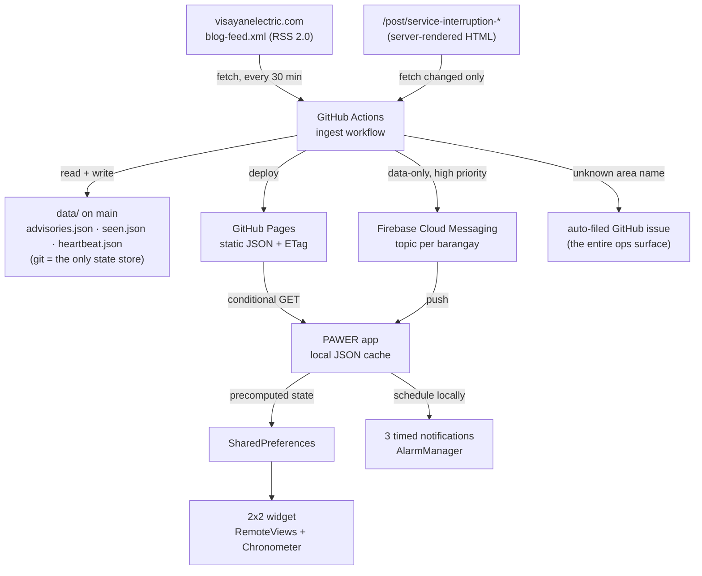

# PAWER — Project Architecture

| | |
|---|---|
| **Version** | 1.1 |
| **Date** | 3 September 2026 |
| **Status** | Approved for implementation |
| **Backend** | GitHub Actions + GitHub Pages ("CI-as-backend, git-as-state") |
| **Client** | Expo / React Native, TypeScript, Android API 24+ |
| **Recurring cost** | $0 |

---

## 1. System overview

PAWER has no application server. A scheduled CI job reads Visayan Electric's public RSS feed, parses changed advisory pages into structured records, commits them to git, publishes them as static JSON, and pushes a notification to per-barangay messaging topics. The mobile client is a local-first reader of that static JSON.



Three properties follow from this shape and are worth stating explicitly, because most of the design serves them:

- **No user data exists anywhere but on the user's device.** Notification targeting is by topic name, so the server publishes to `lahug` and never learns who is listening.
- **The only mutable state is a committed file.** There is no database, and the git history is a free, human-readable audit log of every advisory ever parsed.
- **Nothing needs monitoring.** Failures arrive by email (CI failure) or as an auto-filed issue. There is no dashboard to remember to check.

---

## 2. Data source

### 2.1 Endpoints

| Endpoint | Role |
|---|---|
| `https://www.visayanelectric.com/blog-feed.xml` | RSS 2.0 index. Polled. Also carries unrelated posts (bidding notices, HR, rate announcements) which are filtered out |
| `https://www.visayanelectric.com/post/service-interruption-<range>` | Weekly advisory detail. Fetched only when the feed shows it as new or changed |

Selection rule: RSS `<item>` whose `<title>` matches `/^Service Interruption:/i`. Everything else is ignored.

Two verified facts shape the whole ingestion design: the advisory body is **server-rendered HTML text**, so a plain `fetch` suffices and no headless browser is needed; and it is **text rather than poster images**, so no OCR is required — which is what keeps the project free of AI, as required.

Observed lead time is roughly 3 days (the `Aug 30 – Sep 5` advisory published `Aug 27`), and cadence is weekly.

### 2.2 Document structure

Each advisory page is a sequence of day-group headers, each followed by one or more entries with four labels in fixed order:

```
August 30, 2026 (Sunday)
  Time:            8:00 AM to 4:00 PM (8hrs)
  Purpose:         To improve the reliability of the distribution system…
  Areas Affected:  Portion of Tapul, Talisay City, along portion of Tapul Brgy. Road.
  Map:             (image — never rendered by PAWER)
```

Day-header forms observed: `August 30, 2026 (Sunday)` and `August 30-31, 2026 (Sunday-Monday)`. Cross-month ranges must be assumed to exist.

Time forms observed:

```
8:00 AM to 4:00 PM (8hrs)
10:00 PM of August 30 to 6:00 AM of August 31 (8hrs)
```

### 2.3 Source defects — the governing constraint

The advisories are human-authored, and a two-week sample already contains every category of defect the parser must survive:

| Defect | Real example |
|---|---|
| Doubled punctuation | `Portion of Camputhaw,, Lahug & San Roque` |
| Unclosed parenthesis | `7:00 AM to 5:00 PM (10hrs` |
| Leading whitespace on a label | `​ Time:` |
| Spelling errors | `Escario Strett`, `Mccrew Ville Road` |
| **Non-ASCII hyphen** | `Cantao‑an` uses U+2011, not U+002D |
| Truncated mid-sentence | `including portions of Sitios Kaimpyang, Tubigan, & San` |
| Decimal-hour durations | `(6.17hrs)` |
| **Two different grammars for one field** | see below |

The last is the important one:

```
Areas Affected: Portion of Tapul, Talisay City, along portion of Tapul Brgy. Road.
Areas Affected: Portion of City of Naga & Minglanilla (Alpaco, Balirong, Cantao‑an, …) along portions of …
```

In the first, barangays precede the LGU. In the second, LGUs come first and barangays are parenthesised. **Any parser that grammar-parses this sentence will silently drop entries** — and a dropped entry is a missed brownout, the worst failure this system has. §5 inverts the problem to avoid it.

---

## 3. Ingestion alternatives considered

| Option | Verdict |
|---|---|
| Authenticated Facebook scraping | **Rejected.** Violates Meta's terms, requires a login session, invites account termination and datacenter-IP blocking, and fails silently. It was the original concept |
| Unauthenticated Facebook access | **Rejected.** Post content is behind a login wall; intermittent at best |
| Facebook Graph API | **Not available.** Requires a Page access token that only Visayan Electric could grant |
| Human-in-the-loop admin paste | **Rejected for v1.** Fully reliable and legal, but requires a person watching Facebook. Remains the only viable route to emergency-outage coverage |
| **VECO website RSS + post HTML** | **Selected.** Public, unauthenticated, terms-compliant, structured text, and backed by a regulatory disclosure obligation rather than a marketing choice |

The cost of this decision is the deferral of emergency, cancelled, and confirmed-restoration alerts (PRD §5). It was accepted deliberately: partial coverage, disclosed honestly, beats full coverage that breaks without warning.

---

## 4. Ingestion pipeline

### 4.1 Workflow

`.github/workflows/ingest.yml`, on `cron: */30 * * * *` plus `workflow_dispatch`. GitHub's scheduled runs are best-effort and may be delayed several minutes under load, which is irrelevant against a weekly-changing source.

```
1  fetch blog-feed.xml
2  select items matching /^Service Interruption:/i
3  diff against data/seen.json  (url -> content hash)
4  for each new or changed item:
5      fetch post HTML
6      parse (packages/parser — pure, no I/O)
7      merge into advisories.json, keyed by stable outage id
8  if changed:
9      commit data/  →  deploy Pages  →  push FCM to affected topics
10 if any unknown area name:  open or update a GitHub issue
11 if no commit made today:   commit data/heartbeat.json
```

Required permissions: `contents: write`, `issues: write`, `pages: write`, `id-token: write`.

**Map generation is a separate workflow.** `.github/workflows/maps.yml` runs on changes to the barangay registry and on manual dispatch — never on the ingest schedule. Regenerating 232 static images every 30 minutes would be pure waste against a dataset that changes when a barangay is added, which is approximately never. It reads `MAPTILER_KEY` from Actions secrets, writes `dist/v1/maps/`, and is the only place that key is ever used (§12, ONBOARDING-AND-TOUR.md §4).

### 4.2 State in git

| File | Role |
|---|---|
| `data/advisories.json` | Canonical parsed dataset |
| `data/seen.json` | `{ post_url: content_hash }` — the de-duplication ledger. **This file is the database** |
| `data/notified.json` | Outage ids already pushed, so a re-parse never re-notifies |
| `data/heartbeat.json` | Daily liveness timestamp |
| `data/raw/<slug>.html` | Optional snapshot of each parsed page, for corpus growth and regression tests |

Committing state has a property a database would not: every change to the dataset is a reviewable diff with a timestamp and an author. Debugging a mis-parse three months later is `git log -p`.

### 4.3 Publishing

Pages is deployed **via Actions** (`upload-pages-artifact` + `deploy-pages`), not from a branch folder — this keeps served artifacts (`dist/`) separate from committed state (`data/`) and avoids colliding with `/docs`.

Published paths:

```
/v1/advisories.json     parsed dataset
/v1/maps/{lgu}.{brgy}.webp  barangay locator images, pre-rendered at build time
/v1/registry.json       barangay registry (LGU, display names, aliases)
/v1/version.json        latest APK version, download URL, min_schema_version
```

GitHub Pages emits `ETag` and `Cache-Control`, which the client uses for conditional requests. With weekly-changing data, the large majority of client fetches resolve as ~300-byte `304`s.

### 4.4 The 60-day trap

GitHub disables scheduled workflows after 60 days without repository activity. If Visayan Electric went quiet for two months, ingestion would stop **and nothing would say so** — the most dangerous failure mode in the design, because it is silent.

Mitigation (PRD NFR-23): step 11 commits a heartbeat once per calendar day when no data commit occurred. Activity is then guaranteed regardless of source behaviour.

### 4.5 Operational monitoring

Two mechanisms, both push-based, neither requiring anyone to look at anything:

1. **Workflow failure** → GitHub emails the maintainer.
2. **Unknown area name** → the workflow opens an issue titled `Unknown area: "<token>"`, de-duplicated by searching existing open issues. Resolution is one line added to the alias table.

Expected steady-state burden: under one action per month.

---

## 5. Parser

`packages/parser` — pure TypeScript, HTML string in, records out. No network, no filesystem, no clock, no environment access. This is what lets the identical code run in CI today and in a Cloudflare Worker later, and what makes it exhaustively testable against a static corpus.

### 5.1 Normalisation

Applied before any matching:

1. Unicode NFKC.
2. Unify dashes: U+2010–U+2015 and U+2212 → `-`.
3. Unify spaces: U+00A0, U+2007, U+202F → `U+0020`.
4. Collapse runs of whitespace; trim every line.
5. Collapse repeated commas (`,,` → `,`).
6. **Expand honorific abbreviations**: `Sta.` → `Santa`, `Sto.` → `Santo`, `Gen.` → `General`, `Brgy.` → removed.
7. Casefold for comparison only — never for display.

Step 2 alone is what makes `Cantao‑an` matchable.

**Step 6 is a correctness requirement, not tidiness.** VECO writes `Sta. Cruz`; the registry holds `Santa Cruz` in both Cebu City and Liloan. Without expansion, *every* Santa Cruz advisory silently fails to match — a false negative, which is the one failure class this product cannot absorb. Confirmed in real advisory text (COVERAGE-GLOSSARY.md §5).

### 5.2 Segmentation

Day headers and `Time:` labels are the only structural anchors, and both are trimmed before matching so a stray leading space cannot break segmentation.

```
month = January|February|…|December

dayHeader := ^{month}\s+\d{1,2}
             (?:\s*-\s*(?:{month}\s+)?\d{1,2})?
             ,\s*\d{4}\s*\([^)]*\)$

entry     := split body on /^Time:\s*$/m
fields    := Time | Purpose | Areas Affected | Map   (in order; Map discarded)
```

### 5.3 Time resolution

```
sameDay  := (\d{1,2}:\d{2}\s*[AP]M)\s+to\s+(\d{1,2}:\d{2}\s*[AP]M)
explicit := (\d{1,2}:\d{2}\s*[AP]M)\s+of\s+({month}\s+\d{1,2})\s+to\s+
            (\d{1,2}:\d{2}\s*[AP]M)\s+of\s+({month}\s+\d{1,2})
duration := \((\d+(?:\.\d+)?)\s*hrs?\)?        // closing paren optional — see §2.3
```

- `explicit` wins when present; its dates override the day header.
- With `sameDay`, if `end <= start` the interruption crosses midnight and `end` advances one day.
- The parsed duration is **cross-checked** against `end - start`. A mismatch beyond ±2 minutes downgrades the entry to `partial` rather than trusting either value silently.
- Durations are stored as minutes and rendered as `6h 10m` (Design Guidelines §2.2), never as the source's `6.17hrs`.

### 5.4 Area resolution — registry scan, not sentence parse

The inversion that makes §2.3's two grammars irrelevant: **do not parse the sentence — scan it for names we already know.**

```
0  split head/tail  cut at the first / \balong\b / ; scan the HEAD only
1  detect LGUs      scan head for LGU names and aliases
2  restrict scope   candidate barangays = those belonging to detected LGUs
3  detect barangays scan head for candidate names, longest-match first, word-bounded
4  detect unknowns  remove matched LGU and barangay spans from the head, split the
                    remainder on [,&()] and flag residual tokens
```

**Step 0 — head/tail split.** Every observed entry follows the shape:

```
Portion of <AREAS>, <LGU>, along <STREETS>, including portions of Sitios <SITIOS>, and <SUBDIVISIONS>.
```

The tail after `along` carries street, sitio, subdivision, and compound names — **not barangays** — and matching it produces false positives. This is not hypothetical: one real entry reads `Portion of Camputhaw,, Lahug & San Roque, Cebu City, along portion of Gorordo Avenue, including portions of Sitios Avocado, Drihoa, Kamagong, Kawayan, & San Roque…` — where `San Roque` appears **both** as a barangay in the head and as a *sitio* in the tail. Scanning only the head keeps sitio names from ever being read as barangays.

The split must be on ` along ` with word boundaries rather than `, along`, because the parenthesised grammar omits the comma: `Portion of City of Naga & Minglanilla (Alpaco, Balirong, …) along portions of Balirong Road`. Entries with no `along` fall back to whole-text scanning and are marked `partial` if area resolution is ambiguous.

**Step 2 is not an optimisation — it is a correctness requirement.** `Colon` is a barangay of the City of Naga *and* one of Cebu City's best-known streets. Unscoped matching would attach Naga interruptions to Cebu City readers and vice versa. Restricting candidates to the LGUs actually named in the entry resolves this class of collision deterministically.

**Step 3 — full-token consumption, not prefix matching.** Longest-match-first is necessary but **not sufficient**, because word-boundary anchoring alone is defeated by the roman-numeral families: `Lawaan I` is a word-bounded match inside `Lawaan II` under naive tokenisation. A match must therefore consume the **entire** comma- or ampersand-delimited area token, never a prefix of it. Same hazard in `Sudlon I`/`Sudlon II`, `Sambag I`/`Sambag II`, and `Poblacion Ward I`–`IV`.

**Step 3 — the ambiguity fan-out.** When a short form matches several barangays *within one LGU* — `Portion of Basak, Cebu City` could be `Basak Pardo` or `Basak San Nicolas`; `Cogon, Cebu City` could be `Cogon Pardo` or `Cogon Ramos` — the entry is genuinely ambiguous and LGU scoping cannot help, because both candidates sit in the same LGU. Resolution: **fan out to every candidate and downgrade the entry to `partial`**, then log it for alias review. Over-notifying two adjacent barangays is recoverable; missing one is not.

Full inventory of these same-LGU collisions — 34 records across all eight LGUs, with `Pardo` alone colliding with six other Cebu City barangays — is in COVERAGE-GLOSSARY.md §3.1.

**Step 4 corrects an earlier spec error.** A previous draft located unknown tokens "in the leading segment before the first LGU mention" — which is empty under the parenthesised grammar, where the LGU comes *first*. Subtracting matched spans from the head works identically under both grammars.

### 5.5 Parse status

No entry is ever discarded (PRD NFR-21).

| Status | Condition | Client behaviour |
|---|---|---|
| `parsed` | Date, time, ≥1 LGU and ≥1 barangay all resolved; duration cross-check passes | Full display; notifications fire |
| `partial` | Time resolved, but area resolution incomplete or an unknown token was found | Displayed on `notice` fill with a source link; **notifications fire only for barangays that did resolve** |
| `failed` | Date or time unresolvable | Displayed as "couldn't read this advisory" with a source link; no notifications |

A `failed` entry is still valuable: the user learns an advisory exists for their week and can read VECO's original. Visible degradation beats invisible loss.

### 5.6 Geographic accuracy

This section exists because the first draft of this document was wrong. It described VECO's franchise as ten LGUs, including **Lapu-Lapu City and Cordova**. Both are outside the franchise and are served by a different distribution utility. The error came from model memory rather than from a source, and it is exactly the kind that testing would never catch: the app would have compiled, run, and offered Mactan residents barangays that could never produce an advisory — no error, no empty state, just permanent silence indistinguishable from good news.

Barangay and LGU data is therefore treated as **verified reference data**, not as something to be recalled or inferred.

| # | Rule |
|---|---|
| **R1** | **PSGC is the sole authority** for barangay names and lists — **implemented**: `packages/registry/psgc/*.json` (psgc.gitlab.io mirror, 9-digit codes) is the canonical input to the registry build; the glossary supplies aliases only. Never model memory; never advisory text alone |
| **R2** | The franchise boundary is **narrow and authoritative**: the cities of Cebu, Mandaue, Talisay, Naga, and the municipalities of Liloan, Consolacion, Minglanilla, San Fernando. Sourced from Visayan Electric's own published profile. Nothing outside it enters the registry |
| **R3** | **The two-Nagas trap.** "City of Naga" is nationally ambiguous — Naga, Cebu (Region VII) versus Naga City, Camarines Sur (Region V). A search for the name alone returns the Bicol city, whose PSGC code begins `05`. Registry seeding must key on the **Cebu province PSGC code**, never on the name string |
| **R4** | **Spelling variance is expected and must be captured as aliases.** PhilAtlas spells one Naga barangay `Alfaco`; Wikipedia and VECO's own advisory both spell it `Alpaco`. Both must resolve to a single slug, or advisories for it will silently fail to match |
| **R5** | **Non-ASCII characters occur in official names, not only in VECO's typos.** `Cantao‑an` renders with U+2011 on Wikipedia as well as in the advisory. The normalisation in §5.1 is therefore a correctness requirement, not defensive coding |
| **R6** | Every registry entry carries **provenance** — its PSGC code and the source it was verified against |
| **R7** | **Release gate — implemented.** The build fails if any glossary name does not resolve to a PSGC barangay, any PSGC barangay is missing from the glossary, or an alias collides with a same-LGU name. Output: `packages/registry/verification.md` |
| **R8** | **Barangay names repeat across LGUs.** Confirmed in real advisories: `San Roque` exists in **both** Cebu City and Liloan. `Sta. Cruz`, `Basak`, `Cogon`, `Patag` and the `Poblacion` variants are further candidates. A slug is therefore always `{lgu}.{barangay}`, never a bare name, and **any UI listing an ambiguous name must show its LGU** |
| **R9** | **Coverage report.** The pipeline maintains a per-barangay last-seen date. A registry barangay that appears in **no** advisory across 12 weeks is reported for review — it is either genuinely unserved or, more likely, an alias mismatch silently failing to match. This is the only mechanism that can detect a *false negative*, and false negatives are the failure this product cannot tolerate |
| **R10** | **PSGC is not static.** Barangays are created, renamed, split, and merged. The registry carries the PSGC edition it was verified against, and is re-diffed on each app release rather than treated as settled |
| **R11** | **LGU scoping does not resolve same-LGU substring collisions**, and presenting it as the general answer to name collisions was an overstatement. `Pardo` is a Cebu City barangay *and* a substring of six others in Cebu City. Handled by full-token consumption plus a substring guard (§5.4 step 3), never by scoping |
| **R12** | **Ambiguity fans out; it never guesses.** A short form matching several same-LGU barangays alerts **all** candidates and marks the entry `partial`. A false positive costs a wasted notification; a false negative costs a missed brownout |
| **R13** | **Honorific abbreviations are expanded during normalisation** (§5.1 step 6). VECO's `Sta. Cruz` must reach the registry's `Santa Cruz` |
| **R14** | **Secondary sources disagree, so no single one is canonical.** PhilAtlas and Wikipedia differ on at least four names (COVERAGE-GLOSSARY.md §1). Until PSGC is consulted, **every observed variant is an alias of one slug** — the registry never picks a winner it cannot justify |

**Collisions come in three distinct types**, each needing different machinery. Conflating them was the flaw in the original design.

| Type | Example | Resolved by |
|---|---|---|
| **1** — barangay vs street/sitio | `Colon` (Naga barangay) vs Colon Street (Cebu City) | Head/tail split, §5.4 step 0 |
| **2** — same name, different LGUs | `San Roque` in Cebu City, Talisay **and** Liloan | LGU-qualified slugs + LGU-scoped matching (R8) |
| **3** — substring within one LGU | `Basak` inside `Basak Pardo` / `Basak San Nicolas` | Full-token consumption + fan-out (R11, R12) |

`Colon` is a verified barangay of the City of Naga (2020 census population 5,245); its collision is with a *street*, making it Type 1. `Basak` is Type 2 **and** Type 3 simultaneously — standalone barangays in Mandaue City and San Fernando, plus a substring of two Cebu City barangay names.

The full registry, disambiguation index, and collision inventory live in **COVERAGE-GLOSSARY.md** — 232 barangays, of which 27 carry names shared across LGUs and 33 participate in same-LGU substring collisions. Roughly one barangay in nine is ambiguous by name alone, so this is the normal case rather than an edge case.

A caveat that R2 does not settle: VECO's franchise is stated at LGU level, so it is not yet established that **every** barangay inside a franchise LGU is actually served. If it is not, an unserved barangay would appear selectable and stay permanently silent — the same failure class as the Lapu-Lapu error. Resolving this is an M2 gate (PRD §15).

---

## 6. Data contracts

### 6.1 `advisories.json`

```jsonc
{
  "schema_version": 1,
  "generated_at": "2026-09-02T10:15:00Z",
  "source_attribution": "Visayan Electric Company",
  "outages": [
    {
      "id": "a3f1c9d2e8b4…",
      "start": "2026-08-30T22:00:00+08:00",
      "end":   "2026-08-31T06:00:00+08:00",
      "duration_minutes": 480,
      "lgus": ["cebu-city"],
      "barangays": ["camputhaw", "capitol-site", "lahug", "san-roque"],
      "unknown_area_tokens": [],
      "areas_raw": "Portion of Camputhaw, Capitol Site, Lahug & San Roque, Cebu City, along…",
      "purpose_raw": "To improve the reliability of the distribution system…",
      "parse_status": "parsed",
      "source_post_url": "https://www.visayanelectric.com/post/service-interruption-…",
      "source_published_at": "2026-08-27T09:12:00Z"
    }
  ]
}
```

Two decisions carry disproportionate weight.

**Absolute instants, never date-plus-time-of-day.** Real advisories contain `10:00 PM of August 30 to 6:00 AM of August 31`. A date-keyed model cannot represent that, and cross-midnight windows are common — a fifth of the sample.

**Content-hash ids.** `id = sha256(source_post_url + start + end + areas_raw)[0..16]`. Stable across re-parses, so re-running the pipeline never re-notifies. Any change to the window or the area text produces a new id, which is the desired behaviour: it is genuinely a different interruption.

### 6.2 `registry.json`

```jsonc
{
  "schema_version": 1,
  "lgus": [
    { "slug": "cebu-city", "display": "Cebu City", "psgc": "0722100000",
      "aliases": ["cebu city"] },
    { "slug": "naga", "display": "City of Naga", "psgc": "0722300000",
      "aliases": ["city of naga", "naga city", "naga"] }
  ],
  "barangays": [
    { "slug": "lahug", "display": "Lahug", "lgu": "cebu-city",
      "psgc": "…", "aliases": [], "verified_against": "psgc-2024" },
    { "slug": "cantao-an", "display": "Cantao-an", "lgu": "naga",
      "psgc": "…", "aliases": ["cantao an", "cantaoan"], "verified_against": "psgc-2024" },
    { "slug": "alpaco", "display": "Alpaco", "lgu": "naga",
      "psgc": "…", "aliases": ["alfaco"], "verified_against": "psgc-2024" },
    { "slug": "camputhaw", "display": "Camputhaw", "lgu": "cebu-city",
      "psgc": "…", "aliases": ["kamputhaw"], "verified_against": "psgc-2024" }
  ]
}
```

Seeded from PSGC data for the **eight** LGUs in Visayan Electric's franchise (§5.6 R2), then refined by harvesting historical advisories.

> **All `psgc` values are now real**, sourced from the PSGC mirror and tested: every Naga code begins `072234` (Cebu province), never `05` (Camarines Sur) — the two-Nagas trap (R3) is a test, not a note. PSGC's own spelling is kept as `psgc_name` (e.g. `Camputhaw (Pob.)`) and old names as `psgc_old_name` (`Lorega San Miguel`), both folded into aliases.

`aliases` is the maintenance surface: an auto-filed unknown-area issue is resolved by adding one entry here. The `alpaco` / `alfaco` pair is a real instance (R4), not an example.

### 6.3 `version.json`

```jsonc
{
  "latest_version": "1.0.0",
  "latest_version_code": 100,
  "min_schema_version": 1,
  "download_url": "https://github.com/<owner>/pawer/releases/download/v1.0.0/…apk",
  "sha256": "…",
  "release_notes_url": "https://github.com/<owner>/pawer/releases/tag/v1.0.0"
}
```

`min_schema_version` drives the non-dismissible update prompt (PRD FR-21): a client too old to read the feed correctly must not display possibly-wrong outage data.

---

## 7. Notification architecture

### 7.1 The division of labour

Because the schedule is known days ahead, only one of the four notification events needs a server.

| Event | Mechanism | Works offline |
|---|---|---|
| New advisory | FCM topic push | No |
| Evening before (20:00) | On-device `AlarmManager` | **Yes** |
| One hour before | On-device `AlarmManager` | **Yes** |
| Expected restoration | On-device `AlarmManager` | **Yes** |

This is also the resilience story. Push delivery on budget Android handsets is genuinely unreliable — Xiaomi, Oppo, Vivo and Realme battery managers, all common in the Philippines, kill background handlers aggressively. **The evening-before local alert is the safety net**: it depends on no network and no push, so a user who never receives a single push message still gets warned the night before.

### 7.2 Topics

Format: `veco.v1.{lgu-slug}.{barangay-slug}` — e.g. `veco.v1.cebu-city.lahug`.

**Topics exist at barangay level only.** No LGU-level topic is ever published, which makes LGU-wide subscription impossible *by construction* rather than merely absent from the UI (PRD FR-2g). A future client bug, or a modified APK, cannot subscribe to something the pipeline never publishes to. Enforcing a product decision in the data plane rather than the presentation layer is the cheaper place to put it.

The subscription granularity follows PRD §5.1: level 2 of four. Level 3 tokens — streets, sitios, subdivisions, compounds — are never matched (§5.4 step 0) and therefore never become topics.

FCM topic names permit `[a-zA-Z0-9-_.~%]+`, which all slugs satisfy by construction. The `v1` segment is an escape hatch only; topic names are otherwise **stable forever**, because subscription happens client-side and renaming a topic silences every already-installed client. Should a rename ever become necessary, the pipeline must publish to both the old and new topic sets until the non-dismissible update prompt has retired old clients.

The client subscribes on barangay selection and unsubscribes on deselection. No token is ever transmitted to PAWER's infrastructure, and no record of any device exists (PRD NFR-16).

### 7.3 Data-only messages and de-duplication

Messages are **data-only** with `android.priority: "high"` — high priority is what penetrates Doze — and carry no `notification` payload.

```jsonc
{
  "message": {
    "topic": "veco.v1.cebu-city.lahug",
    "data": { "type": "new_advisory", "outage_ids": "a3f1c9…,b7d2e1…", "schema_version": "1" },
    "android": { "priority": "high", "ttl": "86400s" }
  }
}
```

The reason for data-only is de-duplication. A user watching three affected barangays receives three topic messages for one advisory; a `notification` payload would produce three buzzes, which the OS renders and PAWER cannot suppress. With data-only, the background handler checks each `outage_id` against a local `notified_ids` set and posts exactly **one** local notification (PRD FR-30).

The cost is that a force-stopped app receives nothing — accepted, and covered by §7.1's safety net plus the foreground refresh on next launch.

### 7.4 Local scheduling

Rebuild rather than patch (PRD FR-31). On every successful refresh: cancel all pending PAWER notifications, then re-derive the full set from current data. Idempotent, and it makes withdrawn or rescheduled interruptions self-correct with no server-side cancellation mechanism — which matters, since v1 has no way to learn about a cancellation.

Horizon 14 days, respecting iOS's 64-pending limit. Alarms are **inexact** so Android can batch wakeups and the `SCHEDULE_EXACT_ALARM` permission is avoided; the copy says "in about an hour" accordingly.

> **Verification item.** `expo-notifications` has historically used exact alarms on Android 12+. Whether inexact scheduling is configurable, or whether a small native scheduler is required, must be confirmed during M4. If exact alarms prove unavoidable, the permission trade-off returns for decision.

### 7.5 Server credentials

FCM HTTP v1 requires an OAuth2 access token minted from a service-account key. The key lives only in GitHub Actions secrets and is never present in the app, the repository, or any published artifact. The client needs only the public Firebase configuration.

---

## 8. Mobile client

### 8.1 Stack

| Concern | Choice |
|---|---|
| Framework | Expo (React Native), TypeScript, Hermes |
| Navigation | Two screens plus a sheet — a minimal stack, no tab navigator |
| State | React context and hooks. No Redux, no query library |
| Feed cache | A single JSON file via `expo-file-system` |
| Preferences | `SharedPreferences` via the widget native module, so the widget can read barangays |
| Push | `@react-native-firebase/messaging` (topic subscription requires the Firebase SDK) |
| Local notifications | `expo-notifications` |
| Third-party SDKs | **None beyond the above.** No analytics, no crash reporting, no ads (PRD NFR-9) |

### 8.2 Layers

```
ui/          screens, components — no I/O, no date maths
domain/      state machine, notification derivation, filtering  (pure, unit-tested)
data/        fetch + cache + conditional requests
platform/    native bridges: widget prefs, notifications, push
```

`domain/` is pure and shares its time helpers with `packages/parser`, so the pipeline and the client can never disagree about when an interruption starts.

### 8.3 Time handling — a fixed offset, no timezone database

**The Philippines observes no daylight saving time and has not since 1978.** PAWER therefore uses a hard-coded `+08:00` offset rather than a timezone library or `Intl` (whose support under Hermes is partial).

- Comparisons and arithmetic operate on epoch milliseconds — timezone-independent by nature.
- Display and "today" boundaries derive from a fixed `+08:00` offset.
- `Asia/Manila` is authoritative regardless of the device's own timezone, so a user travelling abroad still sees Cebu times rather than shifted ones.

This removes a dependency, a class of DST bug, and several hundred kilobytes.

### 8.4 Refresh

Triggers only (PRD FR-15–16): cold start · foreground after more than an hour · push receipt · pull-to-refresh. **No periodic background polling exists.**

Requests send `If-None-Match`; `304` counts as a successful freshness update. A failed fetch leaves the cache untouched (PRD FR-18) — last-known-good data is strictly better than an empty screen, and the freshness indicator already tells the user how old it is.

### 8.5 Status derivation

`domain/status.ts` implements PRD §7.1 as a pure function:

```ts
resolveStatus(outages: Outage[], barangays: Slug[], nowMs: number, fetchedAtMs: number)
  => { state, activeOutage?, nextOutage?, isStale }
```

Same function drives the dashboard hero and the precomputed widget blob, so the two surfaces are structurally incapable of disagreeing.

---

## 9. Widget

### 9.1 Constraints that dictate the design

A widget cannot run React Native. It has no JS runtime, no network, and no access to the app's file cache. It is a `RemoteViews` tree inflated by the system in the launcher's process.

**Classic `RemoteViews` + `AppWidgetProvider`, not Jetpack Glance.** Glance is Compose-based and imports the Compose runtime, raising APK size and memory floor against an explicit low-resource requirement. This reverses an earlier recommendation (BRD D-8).

### 9.2 The `SharedPreferences` bridge

The app precomputes everything the widget needs and writes a small blob on each refresh; the widget reads it and does only date arithmetic in Kotlin (PRD FR-27).

```jsonc
// SharedPreferences "pawer_widget"
{
  "state": "ONGOING",
  "label": "NOW",
  "primary_until_ms": 1756645200000,   // Chronometer base
  "secondary": "until 4:00 PM",
  "area_label": "Lahug",
  "next_start_ms": null,
  "fetched_at_ms": 1756630000000,
  "boundaries_ms": [1756645200000, 1756666800000]
}
```

No JSON parsing of the main cache, no bridge startup, no network, no JS. Widget redraw is inflate-plus-arithmetic.

### 9.3 Countdown with zero wakeups

```xml
<Chronometer android:id="@+id/countdown"
             android:layout_width="wrap_content"
             android:layout_height="wrap_content"
             android:textSize="40sp"
             android:textStyle="bold" />
```

```kotlin
views.setChronometer(R.id.countdown, primaryUntilMs, "%s", true)
views.setChronometerCountDown(R.id.countdown, true)   // API 24+
```

**The system renders the tick.** A live countdown therefore costs the app nothing — no `AlarmManager`, no `WorkManager`, no periodic refresh. `setChronometerCountDown` requires API 24, which matches PAWER's floor exactly.

This is the single most important power decision in the project. The conventional approach — a periodic widget update to redraw a countdown — is the classic Android battery trap, and it is avoided outright.

### 9.4 Update scheduling

```xml
<appwidget-provider android:updatePeriodMillis="0" … />
```

Framework periodic updates are **disabled entirely**. Redraws occur only at genuine state boundaries, armed with `AlarmManager.setAndAllowWhileIdle` (inexact, Doze-tolerant):

| Day | Wakeups |
|---|---|
| Nothing scheduled | **1** (local midnight) |
| One interruption | **3** (midnight, start, end) |

Alarms do not survive a reboot, so `RECEIVE_BOOT_COMPLETED` re-arms them.

> **Verification item.** Aggressive OEM battery managers — Xiaomi, Oppo, Vivo, Realme, all common in the target market — may drop alarms or block boot receivers. Behaviour must be measured on at least one such device during M5. PAWER will **not** request battery-optimisation exemption; the degraded outcome is a widget that updates on next app open, which is acceptable.

### 9.5 Theming and scaling

Day/night resource qualifiers (`values/`, `values-night/`) rather than runtime theming, since a widget cannot cheaply query app state. Font scaling follows Design Guidelines §7.5: autosize on API 26+, fixed size with a documented drop-priority order on API 24–25.

### 9.6 iOS readiness

An iOS WidgetKit target is written and maintained but not shipped (PRD NFR-14). WidgetKit is a genuinely better fit for this problem than Android's model — its timeline API accepts entries at arbitrary future instants, and since PAWER knows every start and end in advance it can emit exact timeline entries rather than approximating with alarms. The shared `domain/` layer means only the view layer is platform-specific.

---

## 10. Migration path

Approach A is expected to hold indefinitely (BRD §5.2), but the exit is structural rather than hopeful:

| Coupling | Mitigation |
|---|---|
| Parser | Pure TypeScript, no I/O — runs unmodified in a Cloudflare Worker |
| State | `seen.json` / `notified.json` map one-to-one onto KV keys |
| Serving | Static JSON at stable paths — replaceable by any origin |
| Client | Single `FEED_BASE_URL` constant |

Migration to Cloudflare Workers + Cron Triggers + KV is a runner swap, a KV binding, and a config change. Trigger threshold: any free-tier limit reaching 50% utilisation (BRD BR-19). The parser, the data contracts, and the client are untouched.

---

## 11. Failure modes

| Failure | Detection | Behaviour |
|---|---|---|
| VECO site unreachable | Workflow step fails | Email to maintainer. Client keeps last-known-good; freshness ages |
| Advisory HTML restructured | Entries fall to `failed`; unknown-area issues open | Entries still shown with source links. Recovery target: one working day |
| Unknown barangay name | Registry scan finds unmatched token | Auto-filed issue; entry ships as `partial`; resolved barangays still notify |
| Scheduled workflow disabled | Heartbeat commits stop | Freshness ages; 48h stale warning appears |
| FCM push fails or is throttled | No client-side signal | **Covered by design** — evening-before local alert is push-independent (§7.1) |
| Client offline | Fetch fails | Full functionality from cache; all three local alerts still fire |
| Client too old for schema | `min_schema_version` exceeded | Non-dismissible update prompt; app stops showing outage data rather than risk showing it wrongly |
| Widget alarms dropped by OEM | None | Widget updates on next app open. No exemption requested |
| Barangay outside the franchise is selectable | **None — this is the danger** | Permanent silence, indistinguishable from "no outages scheduled". Prevented at the registry, not at runtime: §5.6 R2 and R7, PRD FR-2a |
| Clock skew or manual clock change | None | All derived states are wrong for that device. Accepted — unfixable without a trusted time source |

The through-line: **every failure degrades toward visible uncertainty, never toward confident wrongness.**

---

## 12. Security

| Concern | Position |
|---|---|
| Secrets in the client | None. Only the public Firebase config ships |
| MapTiler key | **Build-time only**, held in Actions secrets. Map images are pre-rendered in the pipeline, so the app makes no MapTiler request and the key is absent from the APK. A key inside a sideloaded, checksummed APK is trivially extractable — pre-rendering removes the exposure rather than mitigating it |
| FCM service account | GitHub Actions secrets only. Never in the repo or any artifact |
| Transport | HTTPS throughout. `usesCleartextTraffic=false` |
| Permissions | `INTERNET`, `POST_NOTIFICATIONS`, `RECEIVE_BOOT_COMPLETED`. No location, storage, or contacts |
| Untrusted input | Advisory text is data, never markup. Rendered as text nodes; no HTML rendering, no `WebView`, no `dangerouslySetInnerHTML` |
| Supply chain | Lockfile committed, dependencies pinned, dependency count deliberately minimal |
| APK integrity | SHA-256 published per release; single official download channel |

### 12.1 The signing key is a single point of failure

APK-only distribution makes this sharper than it would be on a store. **If the release signing key is lost, no future build can update an installed app** — Android rejects an APK signed with a different key, and every user would have to uninstall and reinstall, losing their settings. There is no Play App Signing safety net here, because there is no Play release.

Requirement: the release keystore and its credentials must be backed up in at least two independent locations before the first public release, and never committed to the repository.

---

## 13. Repository structure

```
pawer/
├── docs/                     PRD · BRD · DESIGN-GUIDELINES · ARCHITECTURE
│                             COVERAGE-GLOSSARY (232 barangays, collision index)
│                             ONBOARDING-AND-TOUR (5 screens + 8 tour steps)
├── packages/
│   ├── parser/               pure TS — no I/O
│   │   ├── src/
│   │   ├── test/
│   │   └── corpus/           real advisory HTML snapshots (test fixtures)
│   └── shared/               domain types, time helpers, status state machine
├── pipeline/
│   └── src/                  rss · diff · merge · fcm · coverage · issues · heartbeat · run (orchestrator, deps injected) · cli · maps/
├── app/
│   ├── src/{ui,domain,data,platform}/
│   └── modules/pawer-widget/
│       ├── android/          Kotlin AppWidgetProvider, RemoteViews layouts
│       ├── ios/              WidgetKit target (written, unshipped)
│       └── plugin/           Expo config plugin
├── data/                     committed state — advisories · seen · notified · coverage · heartbeat
├── release/                  version.json · sha256.json (written by release.yml)
├── assets/maps/              pre-rendered barangay locator images (written by maps.yml)
└── .github/workflows/        ingest.yml · pages.yml · maps.yml · release.yml
```

`packages/shared` exists specifically so the pipeline and the client cannot disagree about time arithmetic or status derivation — the class of bug that would be hardest to notice and most damaging.

---

## 14. Testing

| Layer | Approach |
|---|---|
| Parser | Golden-file tests over `corpus/` — every real advisory in, expected records out. Every defect in §2.3 becomes a permanent regression case |
| Parser edge cases | Cross-midnight windows · cross-month day ranges · both area grammars · the `Colon` LGU-collision case · unclosed parens · U+2011 hyphens · decimal durations · duration mismatch downgrade |
| Head/tail split | The `San Roque` barangay-in-head / sitio-in-tail entry must yield exactly one `san-roque`, from Cebu City. Parenthesised entries with no comma before `along` must split correctly. Entries lacking `along` must fall back without crashing |
| Cross-LGU duplicates | All 13 shared names must resolve to distinct slugs. `San Roque` spans three LGUs; an advisory for one must never match a subscriber to another (§5.6 R8) |
| Same-LGU substrings | `Lawaan I` must not match inside `Lawaan II` or `Lawaan III`. `Pardo` must not match inside any of the six `… Pardo` barangays. `Basak, Cebu City` must fan out to **both** Basak barangays and mark the entry `partial` (R11, R12) |
| Abbreviation expansion | VECO's `Sta. Cruz` must resolve to `liloan.santa-cruz` when Liloan is the named LGU, and to `cebu-city.santa-cruz` when Cebu City is. A regression here is a **silent** false negative (R13) |
| Registry matching | Property test: no barangay slug may match inside another within the same LGU |
| Registry geography | Every entry has a `psgc` code and resolves to a franchise LGU (§5.6 R2/R6). No entry exists outside the eight. Every Naga entry's PSGC code begins with the Cebu province prefix, never `05` (R3). Script-diffed against PSGC at release (R7) |
| Status machine | Exhaustive table test across all five states, including multi-interruption resolution order and cross-midnight days |
| Notification derivation | Given a dataset and a clock, assert the exact scheduled set. Assert idempotent rebuild |
| Pipeline | Integration test against recorded HTTP fixtures. **No live network in CI** |
| Widget | Instrumented test per state on API 24 and current, plus 200% font scale |
| Client | Offline-first behaviour, `304` handling, cache preservation on failed fetch, stale threshold |

**Corpus growth is a policy, not an afterthought.** Every parse failure observed in production is added to `corpus/` with its expected output before the fix is written — which is what turns each of VECO's future formatting surprises into a permanent test rather than a recurring outage.

---

## 15. Build and release

| Step | Detail |
|---|---|
| Build | `expo prebuild` + Gradle — fully local, no Expo account, no cloud quota. Android Studio for local/dev builds; the release workflow runs the same two steps |
| Variants | Per-ABI `arm64-v8a` and `armeabi-v7a`, plus universal fallback (PRD NFR-11) |
| Signing | Release keystore held locally, backed up twice, never committed (§12.1) |
| Distribution | GitHub Releases, with published SHA-256 per artifact |
| Update discovery | `version.json` on Pages, checked at cold start |
| Install guidance | Download page documents enabling installation from unknown sources, and how to verify the checksum |

`release.yml` publishes `version.json` as part of the release, so the version manifest and the artifact it names can never drift apart.

---

## 16. Implementation status (3 September 2026)

| Component | State |
|---|---|
| `packages/shared` | Built and tested — time, status machine, widget-state derivation, local-notification derivation, palette |
| `packages/registry` | Built from **PSGC** with glossary aliases; 232 entries with codes; `verification.md` emitted |
| `packages/parser` | Built and tested against three real advisories (98 entries: 92 parsed · 6 partial · 0 failed); golden locks |
| `pipeline` | Built and tested with injected deps — RSS, diff, merge, FCM (HTTP v1, no SDK), coverage (R9), issues (NFR-22), heartbeat (NFR-23), orchestrator; CLI with real adapters |
| Workflows | `ingest.yml` (30-min poll → commit → Pages → FCM), `pages.yml`, `maps.yml`, `release.yml` (per-ABI signed APKs, SHA-256, manifest). **First live ingest succeeded 3 Sep 2026**: 3 advisories, 98 outages, `data/` committed, Pages serving `v1/advisories.json`, 5 unknown-area issues auto-filed. FCM pending the secret |
| App shell | Onboarding, dashboard, picker, all-areas, detail, settings, tour; neobrutalist system; motion vocabulary; typechecks and bundles |
| App notifications | Local scheduler + FCM topic sync + background de-dup handler wired; needs `google-services.json` and a device to verify |
| Widget | Android `RemoteViews` module (Kotlin) + iOS WidgetKit target (unshipped) written; **not yet compiled** — no Android SDK on the build machine |
| Maps | Compositor from free raster tiles (D-26) **running in CI**: 199 candidate images rendered to the `map-review` artifact; 0 published until a person verifies pins (`scripts/mark-verified.ts`). 33 barangays have no candidate, 26 of them in Mandaue |
